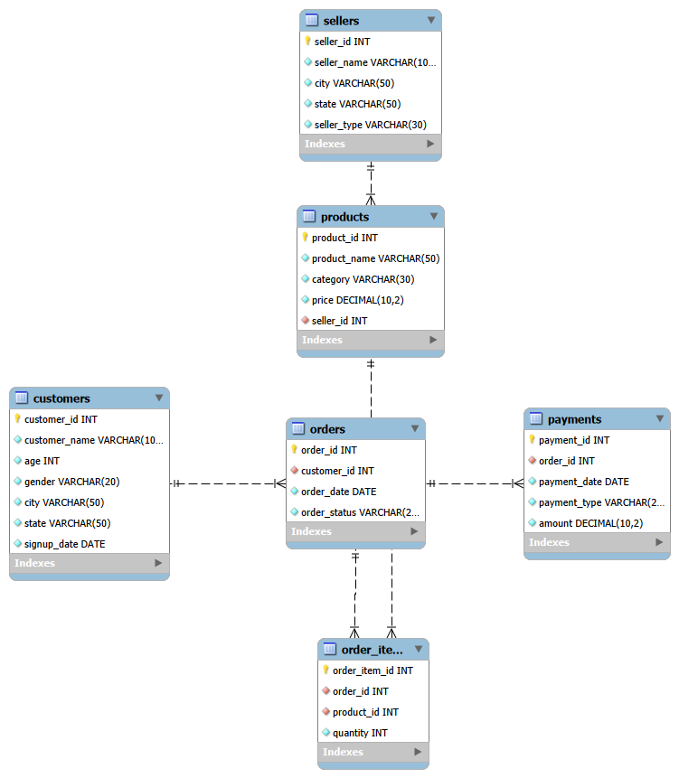
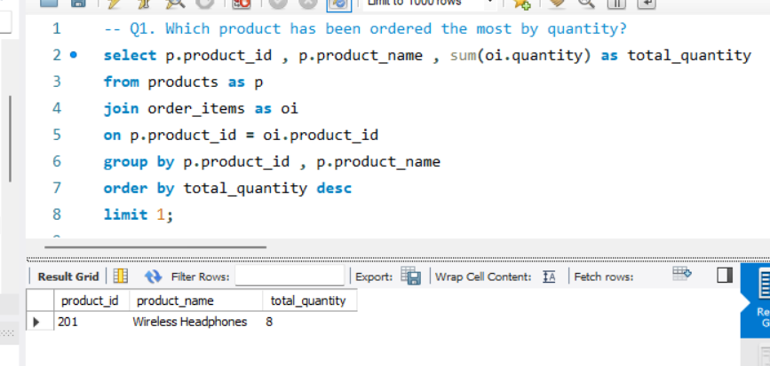
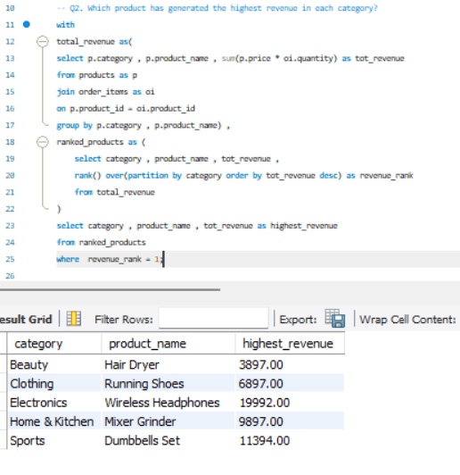
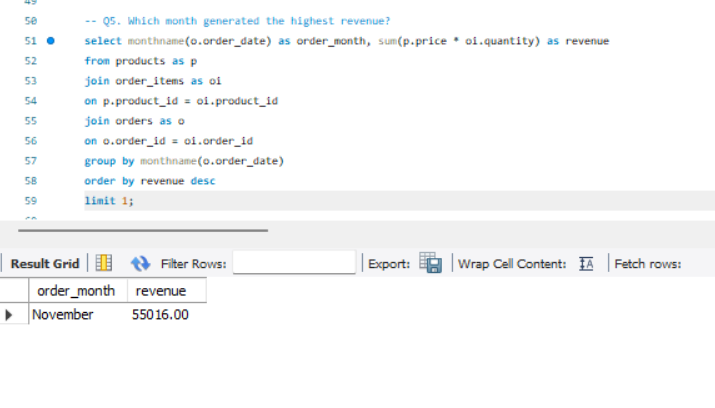
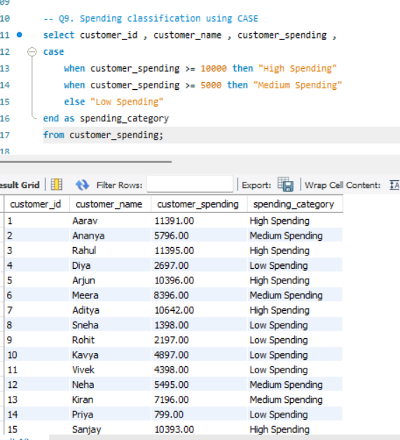
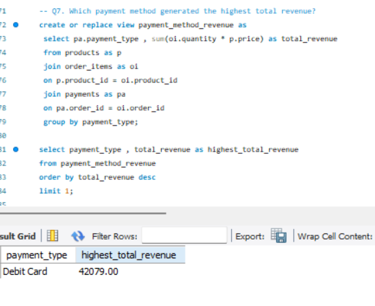

# E-Commerce Sales & Customer Analytics Using MySQL

## Project Overview

This project analyzes an e-commerce database to understand sales performance, customer spending, product demand, seller performance, and payment methods.

The database was designed and populated using MySQL, and SQL queries were used to answer business-related questions through beginner, intermediate, and advanced analysis.

## Tools Used

- MySQL
- MySQL Workbench
- SQL
- Git
- GitHub

## Dataset

This is a custom-built e-commerce dataset created for learning and portfolio purposes.

The database contains sample data for:

- Customers
- Sellers
- Products
- Orders
- Order items
- Payments

## Database Schema

The project uses six related tables:


| Table | Description |
|---|---|
| Customers | Stores customer details |
| Sellers | Stores seller information |
| Products | Stores product details and prices |
| Orders | Stores customer orders |
| Order_items | Stores products included in each order |
| Payments | Stores payment information |

## Business Questions Answered

### Beginner Analysis

- Which customers belong to a specific state?
- Which customers are aged 18 or below?
- Which products cost more than ₹10,000?
- What are the five most expensive products?
- Which orders are currently processing?
- Which orders were placed in September 2025?
- What payment methods are available?
- Who is the most recently registered customer?

### Intermediate Analysis

- How many orders has each customer placed?
- Which customers have placed more than one order?
- How much has each customer spent?
- Which customers spent more than ₹10,000?
- What is the total revenue generated by each product?
- Which product generated the highest revenue?
- What is the revenue generated by each product category?
- How much revenue has each seller generated?
- How many orders are in each order status?
- Which payment method is used most frequently?

### Advanced Analysis

- Which product has been ordered the most by quantity?
- Which product generated the highest revenue in each category?
- Which seller sold the highest quantity of products?
- Which customers placed the highest number of orders?
- Which month generated the highest revenue?
- What is the total revenue generated by each seller type?
- Which payment method generated the highest total revenue?
- Which customers spent more than the average customer spend?
- How can customers be classified using CASE?
- How can a stored procedure display a customer's orders?

## SQL Concepts Used

- SELECT and WHERE
- ORDER BY and LIMIT
- DISTINCT
- INNER JOIN
- LEFT JOIN
- GROUP BY
- HAVING
- Aggregate functions
- Subqueries
- Common Table Expressions
- Window functions
- RANK()
- PARTITION BY
- Views
- CASE statements
- Stored procedures

## Key Findings

- Debit Card generated the highest total revenue among the payment methods in the current sample data.
- Customer spending can be classified into High Spending, Medium Spending, and Low Spending categories using CASE.
- Window functions can be used to rank products within each category.
- Views can simplify repeated analysis by storing reusable query results.

## Project Screenshots

### E-Commerce ER Diagram


### Top-Selling Product



### Highest-Revenue Product in Each Category



### Highest Revenue Month



### Customer Spending Classification



### Highest Revenue Payment Method



## What I Learned

Through this project, I practiced designing a relational database and writing SQL queries to answer practical business questions.

I also learned how to use joins, aggregate functions, CTEs, window functions, views, CASE statements, and stored procedures for data analysis.

## Project Structure

```text
E_Commerce/
├── README.md
├── data/
│   └── 03_insert_data.sql
├── queries/
│   ├── 01_beginner_questions.sql
│   ├── 02_intermediate_questions.sql
│   └── 03_advanced_questions.sql
├── schema/
│   ├── 01_create_database.sql
│   └── 02_create_tables.sql
└── screenshots/
```

## How to Run the Project

1. Open MySQL Workbench.
2. Run `schema/01_create_database.sql`.
3. Run `schema/02_create_tables.sql`.
4. Run `data/03_insert_data.sql`.
5. Execute the queries from the `queries` folder.
6. Review the results in MySQL Workbench.

## Author

Mila Joseph